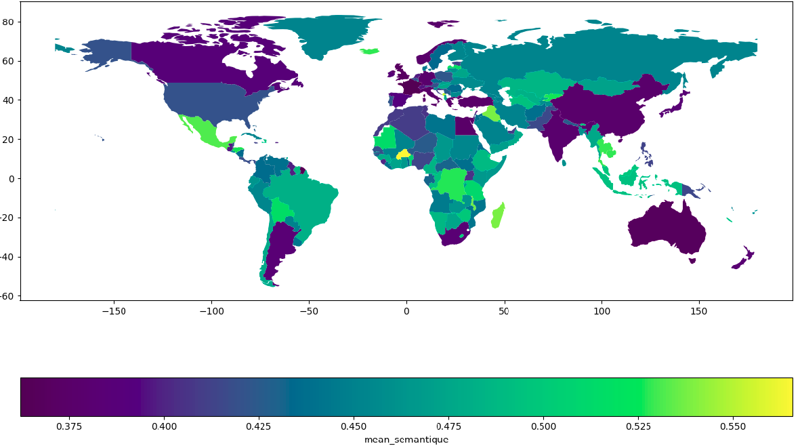
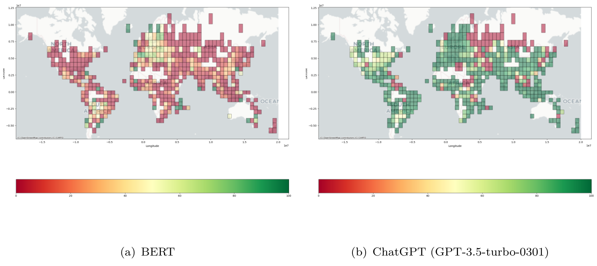

# Geographical Biases in Large Language Models (LLMs)

This tutorial aims to identify geographical biases propagated by LLMs. For this purpose, 4 indicators are proposed.

1. Spatial disparities in geographical knowledge. 
2. Spatial information coverage in training datasets. 
3. Correlation between geographic distance and semantic distance. 
4. Anomaly between geographical distance and semantic distance. 

   
  <strong>Fig. 1:</strong> Average semantic distances (using BERT) between the three most populous cities in a country compared to other cities worldwide.

   
  <strong>Fig. 2:</strong> Percentage of correct country predictions given cities name with more than 100K inhabitants by spatial aggregation in 5° by 5° pixels?

-----
## Authors

|           |
|----------------------|
| Rémy Decoupes        |
| Maguelonne Teisseire |
| Mathieu Roche        |

**Acknowledgement**:

This study was partially funded by EU grant 874850 MOOD and is catalogued as MOOD099. The contents of
this publication are the sole responsibility of the authors and do not necessarily reflect the views of the European
Commission

 

---
## Citing this work

If you find this work helpful or refer to it in your research, please consider citing:

+ *Evaluation of Geographical Distortions in Language Models: A Crucial Step Towards Equitable Representations, Rémy Decoupes, Roberto Interdonato, Mathieu Roche, Maguelonne Teisseire, Sarah Valentin*. 

## This tutorial has been presented in

- **PAKDD'24**: See [slides](slides/PAKDD2024_Tutorial_LM_Spatial.pdf). 

|   |   |   |   |
|---|---|---|---|
|  |  |  |  |
